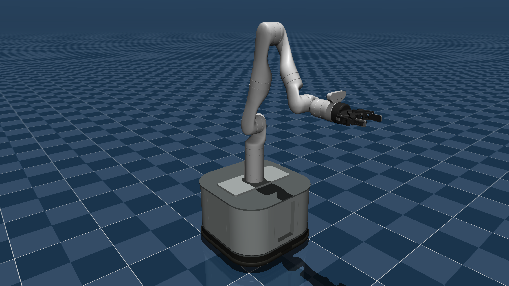
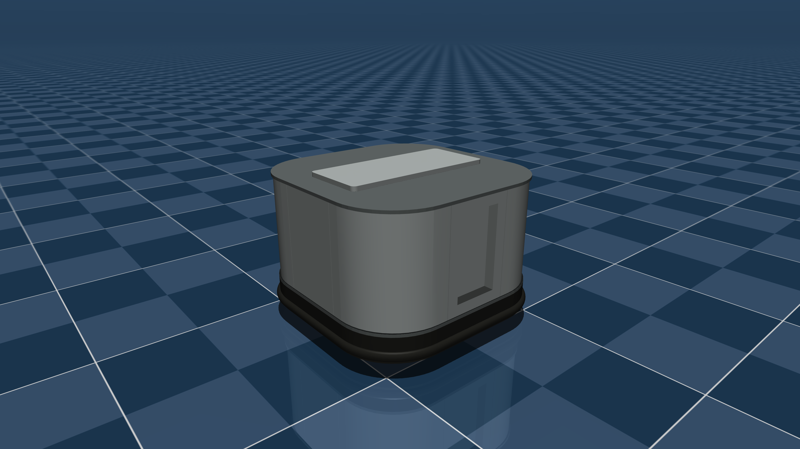

# Stanford TidyBot Description (MJCF)

> [!IMPORTANT]
> Requires MuJoCo 3.1.0 or later.

## Changelog

See [CHANGELOG.md](./CHANGELOG.md) for a full history of changes.

## Overview

This package contains a simplified robot description (MJCF) of the [Stanford TidyBot](https://tidybot.cs.princeton.edu) developed by Jimmy Wu and collaborators from the [Interactive Perception and Robot Learning Lab](https://iprl.stanford.edu) at Stanford University.

<p float="left">
  
  
</p>

## MJCF Model

* The mobile base MJCF was created from a CAD model of the base.
* The Kinova Gen3 MJCF is taken from Menagerie. See [kinova_gen3](../kinova_gen3/).
* The Robotiq 2F-85 MJCF is taken from Menagerie. See [robotiq_2f85](../robotiq_2f85/).

## 底盘交互控制

从仓库根目录同步依赖并运行（使用仓库的 `.venv`）：

```bash
uv sync
uv run python stanford_tidybot/render_base.py
```

脚本通过 `scene_base.xml` 加载 `base.xml`，在地面棋盘格上显示底盘。
在终端输入 `1 0 1.57` 并回车，即设置 X=1 m、Y=0 m、转向角=1.57 rad。
三个输入是世界坐标系下的绝对位置目标，由原模型的位置执行器跟踪。
点击渲染画面后，也可用 W/S 调整目标 X、A/D 调整目标 Y、Q/E 调整目标转角。
H 保持当前位置，R 复位；终端支持 `hold`、`reset`、`status`、`help` 和 `quit`。

可通过 `--target 1 0 1.57` 设置初始目标；
`--headless --duration 5` 可在无窗口模式下运行五秒并打印最终位姿。
在 macOS 上使用 `mjpython` 替代 `python` 启动交互窗口。

## License

The TidyBot base is released under an MIT License. The Kinova Gen3 and Robotiq 2F-85 MJCFs retain
their original licenses. For more information, see the [LICENSE](LICENSE) file.

## Publications

If you use this work in an academic context, please cite the following publication:

```bibtex
@article{wu2023tidybot,
  title = {TidyBot: Personalized Robot Assistance with Large Language Models},
  author = {Wu, Jimmy and Antonova, Rika and Kan, Adam and Lepert, Marion and Zeng, Andy and Song, Shuran and Bohg, Jeannette and Rusinkiewicz, Szymon and Funkhouser, Thomas},
  journal = {Autonomous Robots},
  year = {2023}
}
```
